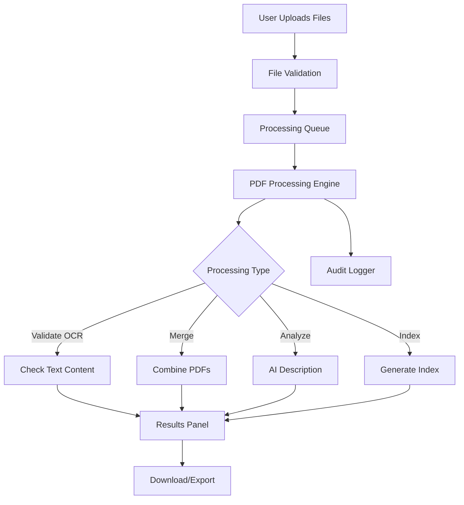

# Client-Side PDF Processor Architecture

## System Overview

This document outlines the architecture for a 100% browser-based PDF processing system. The design prioritizes transparency, auditability, and maintainability while ensuring all processing occurs client-side.

## Design Principles

1. **No Backend Dependencies**: All processing happens in the browser
2. **Transparency**: Unminified, thoroughly commented code
3. **Modularity**: Clear separation of concerns
4. **Auditability**: Comprehensive logging and error tracking
5. **Progressive Enhancement**: Graceful degradation for unsupported features

## Core Components

### 1. File Upload Component
- **Purpose**: Handle file selection, validation, and preview
- **Key Features**:
  - Drag-and-drop interface
  - File type validation
  - Size limit checking
  - Progress tracking

### 2. PDF Processing Engine
- **Purpose**: Core PDF manipulation and processing
- **Modules**:
  - `pdfProcessor.js`: Main PDF operations (merge, split, extract)
  - `ocrValidator.js`: Validate PDF text content and extractability
  - `aiDescriber.js`: AI-powered content analysis and description
  - `indexGenerator.js`: Create searchable indexes

### 3. UI Components
- **Purpose**: User interface elements
- **Components**:
  - `PDFViewer.js`: PDF preview and navigation
  - `ProcessingQueue.js`: Queue management and status
  - `ResultsPanel.js`: Display processing results
  - `ExclusionReporter.js`: Show failed processing reports

### 4. Utility Modules
- **Purpose**: Shared functionality and helpers
- **Modules**:
  - `fileHandlers.js`: File I/O operations
  - `validators.js`: Input validation functions
  - `formatters.js`: Data formatting utilities
  - `auditLogger.js`: Comprehensive audit trail

## Data Flow

## Security Considerations

1. **Client-Side Only**: No server communication ensures data privacy
2. **Local Storage**: Optional caching using localStorage
3. **File Validation**: Strict validation before processing
4. **Memory Management**: Clean up after large file operations

## Performance Optimizations

1. **Web Workers**: Offload heavy processing to background threads
2. **Streaming**: Process files in chunks for large documents
3. **Progressive Loading**: Load PDF pages on demand
4. **Caching**: Cache processed results when appropriate

## Browser Compatibility Matrix

| Feature | Chrome | Firefox | Safari | Edge |
|---------|--------|---------|--------|------|
| PDF Rendering | ✓ | ✓ | ✓ | ✓ |
| File API | ✓ | ✓ | ✓ | ✓ |
| Web Workers | ✓ | ✓ | ✓ | ✓ |
| SharedArrayBuffer | ✓* | ✓ | ✓* | ✓* |
| Service Workers | ✓ | ✓ | ✓ | ✓ |

*\* May require additional headers or permissions*

## Error Handling Strategy

1. **Graceful Degradation**: Fall back to alternative methods
2. **User Feedback**: Clear error messages and guidance
3. **Recovery Options**: Retry mechanisms where appropriate
4. **Audit Trail**: Log all errors for troubleshooting

## Testing Strategy

1. **Unit Tests**: Core functionality testing
2. **Integration Tests**: Component interaction testing
3. **E2E Tests**: Full workflow validation
4. **Performance Tests**: Large file handling verification

## Documentation Standards

1. **Code Comments**: Comprehensive inline documentation
2. **API Documentation**: Clear interface definitions
3. **Architecture Docs**: High-level system overview
4. **User Guides**: Step-by-step instructions