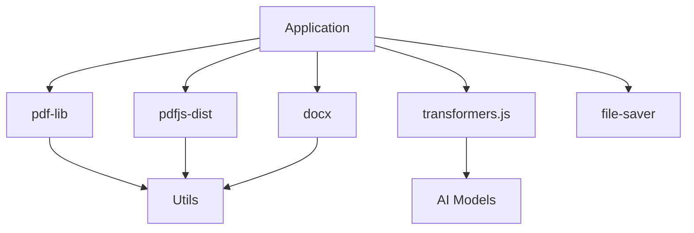

# Project Dependencies

This document provides a comprehensive overview of all dependencies used in the client-side PDF processor project.

## Core Dependencies

### PDF Processing
- **pdf-lib** (^1.17.1)
  - Purpose: PDF creation, modification, and merging
  - Features: Add pages, modify content, add page numbers
  - Size: ~1.2MB
  - Why: Pure JavaScript implementation with excellent documentation

- **pdfjs-dist** (^3.4.120)
  - Purpose: PDF rendering and text extraction
  - Features: View PDFs, extract text content
  - Size: ~5.5MB (can be tree-shaken)
  - Why: Mozilla's PDF.js is the industry standard

### Document Generation
- **docx** (^8.0.2)
  - Purpose: Generate Word documents
  - Features: Create .docx files programmatically
  - Size: ~200KB
  - Why: Simple API for Word document generation

### AI and ML
- **@xenova/transformers** (^2.16.0)
  - Purpose: AI-powered text processing
  - Features: Text summarization, content analysis
  - Size: ~10MB (models loaded on demand)
  - Why: Browser-compatible Transformers implementation

### OCR Validation
- Note: No OCR library needed. Application validates existing text content in PDFs
- Purpose: Verify PDFs contain searchable/extractable text
- Features: Check for text layers, validate content extractability
- Size: 0KB (uses pdf.js capabilities)
- Why: Reduces bundle size, faster processing, assumes pre-OCR'd files

### File Handling
- **file-saver** (^2.0.5)
  - Purpose: Save files client-side
  - Features: Download generated files
  - Size: ~5KB
  - Why: Simple, reliable file saving

## Development Dependencies

### Build Tools
- **vite** (^4.4.9)
  - Purpose: Build tool and dev server
  - Features: Fast HMR, optimized builds
  - Why: Modern, fast, and easy to configure

### Code Quality
- **eslint** (^8.48.0)
  - Purpose: Code linting
  - Features: Enforce coding standards
  - Why: Maintain code quality

- **prettier** (^3.0.3)
  - Purpose: Code formatting
  - Features: Consistent code style
  - Why: Automated formatting

### Testing
- **vitest** (^0.34.4)
  - Purpose: Unit and integration testing
  - Features: Fast testing with Vite integration
  - Why: Modern testing framework

### CSS Framework
- **tailwindcss** (^3.3.3)
  - Purpose: Utility-first CSS framework
  - Features: Rapid UI development
  - Why: Efficient styling without custom CSS

## Total Bundle Size Analysis

### Essential Core
- pdf-lib: 1.2MB
- pdfjs-dist (minimal): ~2MB (with tree-shaking)
- docx: 200KB
- transformers: 10MB (models loaded on demand)
- **Subtotal: ~13.4MB**

### Optional Features
- None (OCR validation built-in)
- **Total: ~13.4MB**

### Development
- vite: 5MB (dev only)
- tailwindcss: 3MB (optimized to ~50KB in production)
- **Subtotal: 8MB (dev only)**

## Load Strategy

### Progressive Loading
1. Core functionality loads immediately (~2MB)
2. AI models load on first use (~10MB)

### Code Splitting
- PDF processing utilities split by feature
- AI models loaded dynamically
- UI components loaded on demand
- OCR validation module included in core bundle

## Browser Support Requirements

### Modern Browser Features Needed
- Web Workers (for background processing)
- SharedArrayBuffer (for memory efficiency)
- File API (for file handling)
- Blob API (for file generation)
- URL.createObjectURL (for preview)

### Polyfills Considered
None required for modern browsers (Chrome 90+, Firefox 88+, Safari 14+, Edge 90+)

## Security Considerations

### Content Security Policy
```
default-src 'self'
script-src 'self' 'unsafe-inline' 'unsafe-eval' blob:
worker-src 'self' blob:
connect-src 'self' blob:
```

### Subresource Integrity
All CDN dependencies use SRI hashes for integrity verification.

## Alternative Libraries Considered

### PDF Libraries
- **jsPDF**: Considered but less feature-rich for merging
- **PDFKit**: Node.js only, not browser compatible

### AI Libraries
- **TensorFlow.js**: More complex setup than needed
- **ONNX Runtime**: Good alternative but transformers.js has better model support

### OCR Libraries
- **OCRAD.js**: Lower accuracy
- **Ocrad**: C++ based, requires WASM compilation

## Maintenance Plan

1. **Monthly Security Updates**: Check for vulnerabilities
2. **Quarterly Feature Updates**: Evaluate new library versions
3. **Annual Major Version Review**: Plan for breaking changes
4. **Performance Monitoring**: Track bundle size impact

## Dependency Graph



## Future Considerations

### Potential Additions
- **WebAssembly**: For performance-critical operations
- **IndexedDB**: For local caching of processed files
- **Service Workers**: For offline capabilities

### Monitoring
- Bundle size tracking
- Performance metrics
- Error reporting (client-side only)