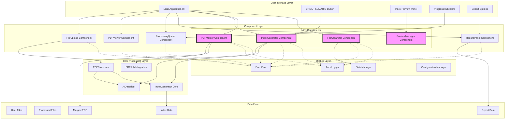
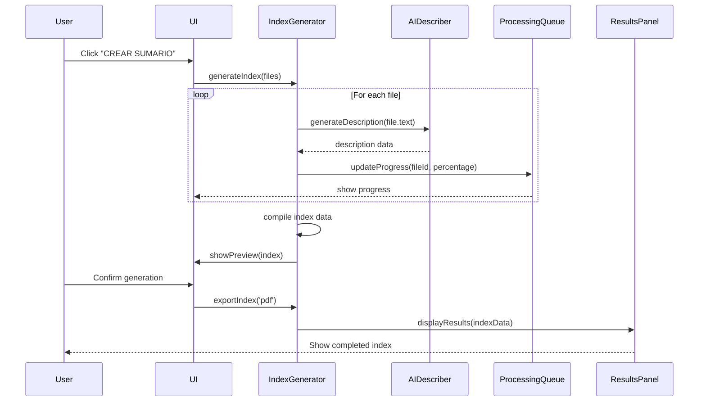

# PDF Document Management System Architecture

## Overview

This document outlines the complete architecture for a comprehensive PDF document management system with document index generation, PDF merging functionality, and advanced file organization capabilities. The system is designed to work entirely client-side, leveraging existing components and following established patterns.

## System Architecture Diagram



## Component Design

### 1. IndexGenerator Component

**Purpose**: Manages the generation of document indexes with various description options.

**API Design**:

```javascript
class IndexGenerator {
  constructor(containerId, options = {
    aiDescriber: null,
    pdfProcessor: null,
    eventBus: eventBus,
    auditLogger: auditLogger
  })

  // Configuration methods
  setDescriptionType(type) // 'filename', 'ai', 'custom'
  setFormattingOptions(options) // pageNumbers, hierarchy, etc.
  
  // Processing methods
  async generateIndex(files)
  async previewIndex(files)
  
  // Export methods
  exportIndex(format) // 'pdf', 'json', 'txt'
  
  // Events emitted
  // - 'index-generation-started'
  // - 'index-generation-progress'
  // - 'index-generation-completed'
  // - 'index-generation-error'
}
```

**Key Features**:
- Three description generation modes:
  - Filename as description
  - AI-powered summarization (using existing aiDescriber.js)
  - Custom manual descriptions
- Configurable formatting options (page numbers, hierarchy levels)
- Preview functionality before final generation
- Multiple export formats

### 2. PDFMerger Component

**Purpose**: Handles merging multiple PDFs into a single document with table of contents.

**API Design**:

```javascript
class PDFMerger {
  constructor(containerId, options = {
    pdfLib: PDFLib,
    eventBus: eventBus,
    auditLogger: auditLogger
  })

  // Merge operations
  async mergePDFs(files, options = {
    maintainPageNumbering: true,
    generateTOC: true,
    customTOCTitle: 'Table of Contents'
  })
  
  // Preview methods
  async createMergePreview(files)
  updateMergeOrder(files)
  
  // Table of Contents
  generateTableOfContents(mergedPDFData)
  
  // Events emitted
  // - 'pdf-merge-started'
  // - 'pdf-merge-progress'
  // - 'pdf-merge-completed'
  // - 'pdf-merge-error'
}
```

**Key Features**:
- Maintain original page numbering or reset numbering
- Automatic table of contents generation
- Customizable TOC appearance
- Merge preview functionality
- Drag-and-drop reordering

### 3. FileOrganizer Component

**Purpose**: Provides various file organization and sorting options.

**API Design**:

```javascript
class FileOrganizer {
  constructor(containerId, options = {
    eventBus: eventBus,
    auditLogger: auditLogger
  })

  // Sorting methods
  sortFiles(files, criteria) // 'filename', 'date', 'size', 'type'
  
  // Ordering methods
  setManualOrder(files)
  saveOrderConfiguration(name)
  loadOrderConfiguration(name)
  
  // UI methods
  renderOrderInterface(files)
  enableDragAndDrop()
  
  // Events emitted
  // - 'files-reordered'
  // - 'order-saved'
  // - 'order-loaded'
}
```

**Key Features**:
- Multiple sorting criteria
- Manual drag-and-drop ordering
- Save/load order configurations
- Integration with file list display

### 4. PreviewManager Component

**Purpose**: Manages preview functionality for indexes and merged documents.

**API Design**:

```javascript
class PreviewManager {
  constructor(containerId, options = {
    pdfViewer: null,
    eventBus: eventBus
  })

  // Preview methods
  async showIndexPreview(indexData)
  async showMergePreview(mergeData)
  
  // Navigation
  navigateToPage(pageNumber)
  zoomPreview(scale)
  
  // Events emitted
  // - 'preview-updated'
  // - 'preview-navigation'
}
```

## Data Flow Architecture



## State Management Strategy

### Global State Structure

```javascript
const globalState = {
  files: {
    uploaded: [],
    processing: [],
    processed: [],
    order: []
  },
  indexGeneration: {
    descriptionType: 'filename',
    formatting: {
      includePageNumbers: true,
      hierarchy: true,
      customFormat: null
    },
    currentConfig: null
  },
  pdfMerge: {
    selectedFiles: [],
    mergeOptions: {
      maintainPageNumbering: true,
      generateTOC: true
    },
    mergeOrder: []
  },
  ui: {
    activeTab: 'upload',
    previewVisible: false,
    processing: false
  }
}
```

### State Management Pattern

1. **Centralized State**: Use a singleton StateManager class
2. **Immutable Updates**: All state changes create new state objects
3. **Event-Driven**: State changes emit events for component updates
4. **Persistence**: Save critical state to localStorage

```javascript
class StateManager {
  constructor() {
    this.state = this.loadInitialState();
    this.listeners = [];
  }

  // Get current state
  getState() {
    return this.state;
  }

  // Update state with immutable pattern
  updateState(path, value) {
    const newState = this.setIn(this.state, path, value);
    this.state = newState;
    this.emit('state-changed', { path, value, state: newState });
    this.saveToStorage();
  }

  // Subscribe to state changes
  subscribe(listener) {
    this.listeners.push(listener);
  }

  // Immutable set helper
  setIn(obj, path, value) {
    // Implementation for deep immutable updates
  }
}
```

## Error Handling Approach

### Error Types

```javascript
// Custom error classes
class PDFProcessingError extends Error {
  constructor(message, file, cause) {
    super(message);
    this.name = 'PDFProcessingError';
    this.file = file;
    this.cause = cause;
  }
}

class IndexGenerationError extends Error {
  constructor(message, config, cause) {
    super(message);
    this.name = 'IndexGenerationError';
    this.config = config;
    this.cause = cause;
  }
}

class MergeError extends Error {
  constructor(message, files, cause) {
    super(message);
    this.name = 'MergeError';
    this.files = files;
    this.cause = cause;
  }
}
```

### Error Handling Strategy

1. **Boundary Checks**: Validate all inputs before processing
2. **Graceful Degradation**: Provide fallbacks for failed operations
3. **User Feedback**: Clear error messages with recovery options
4. **Logging**: Comprehensive error logging for debugging

```javascript
// Error handling middleware
async function withErrorHandling(operation, context) {
  try {
    return await operation();
  } catch (error) {
    // Log error
    auditLogger.error(`${context} failed`, {
      error: error.message,
      stack: error.stack,
      context
    });

    // Emit error event
    eventBus.emit('error', {
      type: error.name,
      message: error.message,
      context,
      recoverable: isRecoverable(error)
    });

    // Show user-friendly message
    showToast(getUserFriendlyMessage(error), 'error');

    // Return fallback result if applicable
    return getFallbackResult(error, context);
  }
}
```

## Performance Considerations

### 1. Large File Processing

- **Chunk Processing**: Process large PDFs in chunks to prevent UI blocking
- **Web Workers**: Offload heavy processing to web workers
- **Memory Management**: Implement memory pools and cleanup strategies

```javascript
// Web Worker for PDF processing
const pdfWorker = new Worker('src/workers/pdf-processor.js');

// Process in chunks
async function processLargePDF(file, chunkSize = 10) {
  const totalPages = await getPageCount(file);
  const results = [];
  
  for (let i = 0; i < totalPages; i += chunkSize) {
    const chunk = await extractPages(file, i, i + chunkSize);
    results.push(...await processChunk(chunk));
    
    // Yield to UI thread
    await new Promise(resolve => setTimeout(resolve, 0));
  }
  
  return results;
}
```

### 2. Memory Optimization

- **Object Pooling**: Reuse objects instead of creating new ones
- **Lazy Loading**: Load components and data only when needed
- **Cache Management**: Implement LRU cache for frequently accessed data

### 3. Rendering Performance

- **Virtual Scrolling**: For large file lists
- **Debounced Updates**: For search and filter operations
- **Animation Optimization**: Use CSS transforms and will-change

## Integration Points

### With Existing Components

1. **FileUpload Integration**
   - Listen for 'files-selected' event
   - Add files to processing queue
   - Validate file types and sizes

2. **ProcessingQueue Integration**
   - Show index generation progress
   - Handle pause/resume operations
   - Display error states

3. **ResultsPanel Integration**
   - Add new tabs for index results
   - Support index export options
   - Show generation statistics

### Event Bus Extensions

```javascript
// New events for the system
eventBus.emit('index-generation-requested', { files, options });
eventBus.emit('pdf-merge-requested', { files, options });
eventBus.emit('files-reordered', { newOrder });
eventBus.emit('preview-generated', { type, data });

// Event handlers
eventBus.on('index-generation-progress', updateProgressBar);
eventBus.on('pdf-merge-completed', showDownloadOption);
```

## Security Considerations

1. **Client-Side Only**: No server communication, all processing in browser
2. **Input Validation**: Validate all file uploads and user inputs
3. **XSS Prevention**: Proper escaping of all user-generated content
4. **Memory Safety**: Prevent memory leaks with proper cleanup

## Accessibility

1. **ARIA Labels**: Comprehensive labeling for all interactive elements
2. **Keyboard Navigation**: Full keyboard support for all operations
3. **Screen Reader Support**: Compatible with major screen readers
4. **Focus Management**: Proper focus handling for modals and dialogs

## Testing Strategy

1. **Unit Tests**: For all new components and utilities
2. **Integration Tests**: For component interactions
3. **E2E Tests**: For complete workflows
4. **Performance Tests**: For large file handling

## Deployment Considerations

1. **Static Hosting**: Can be deployed to any static hosting service
2. **CDN Optimized**: All external libraries loaded from CDNs
3. **Progressive Enhancement**: Graceful degradation for older browsers
4. **Offline Support**: Service worker for offline functionality (optional)

## Future Enhancements

1. **Cloud Storage Integration**: Save to Google Drive, Dropbox, etc.
2. **Advanced AI Features**: More sophisticated document analysis
3. **Collaboration**: Multi-user editing and commenting
4. **Mobile App**: React Native wrapper for mobile deployment

## Conclusion

This architecture provides a robust, scalable foundation for the PDF document management system. By leveraging existing components and following established patterns, the system maintains consistency while adding powerful new features. The client-side approach ensures privacy and reduces infrastructure costs, while the modular design allows for easy extension and maintenance.